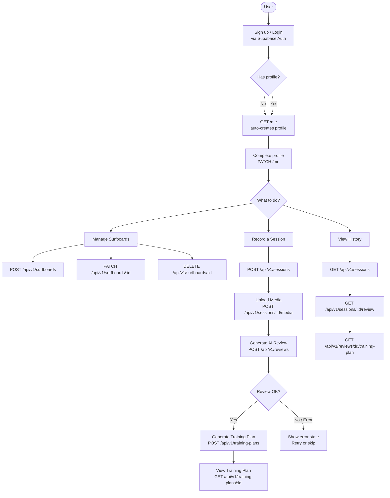
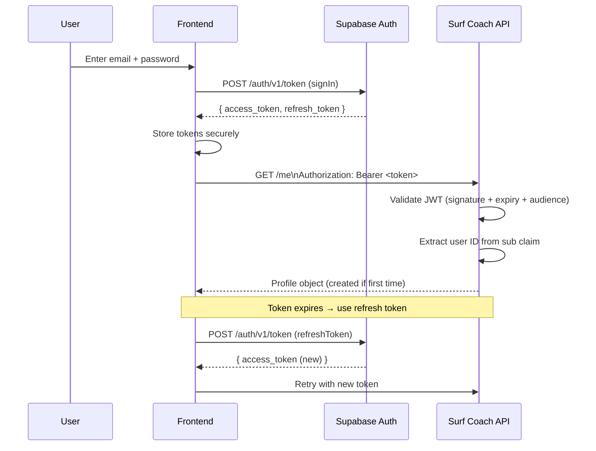
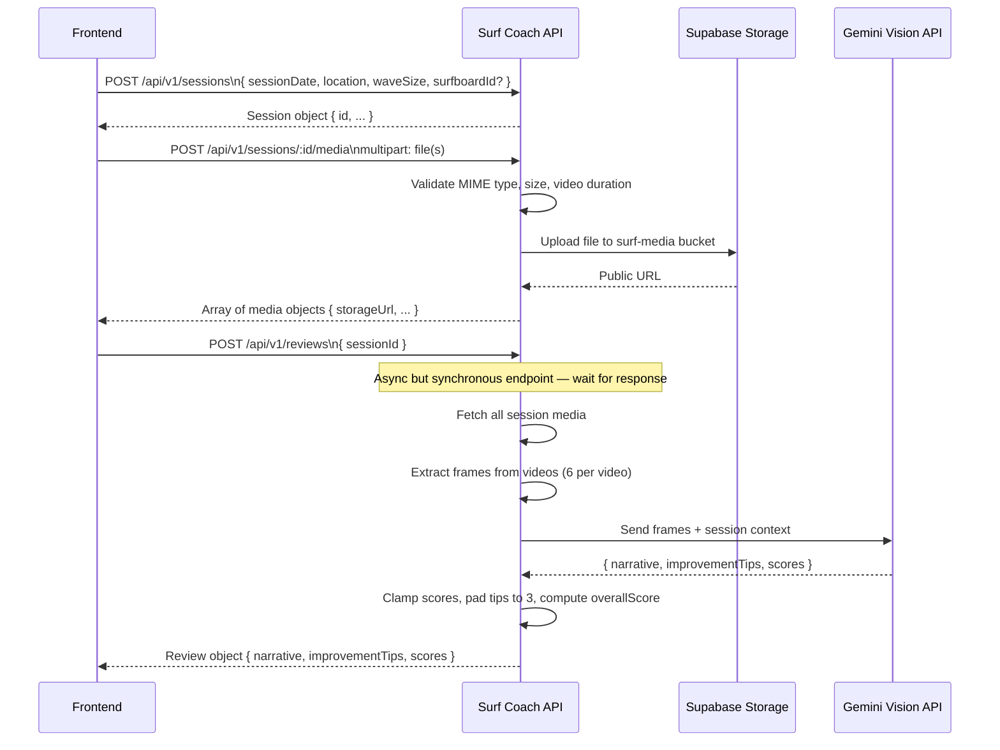
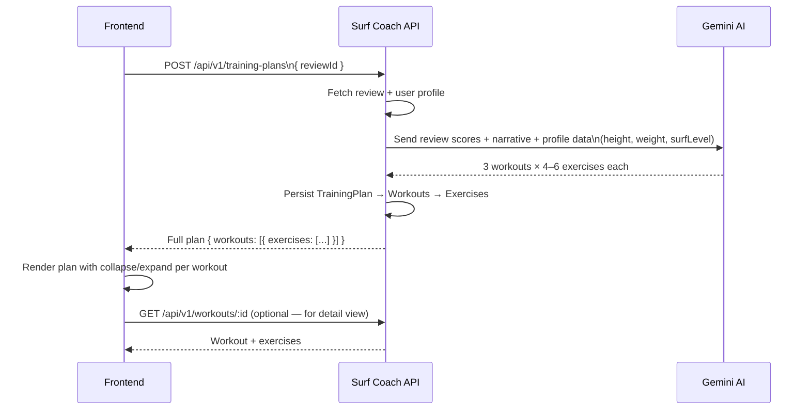
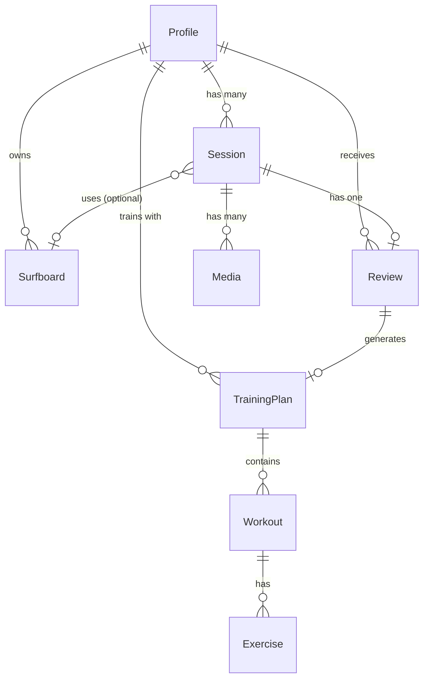
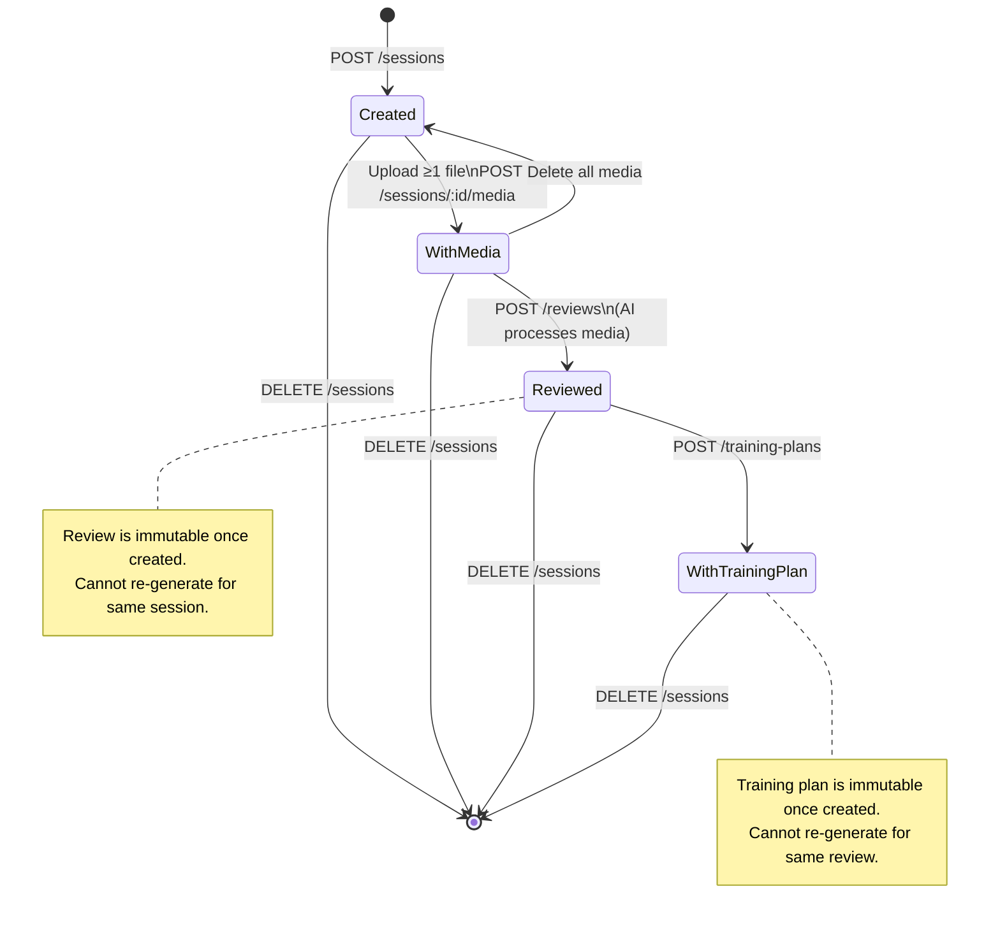

# Surf Coach API — Frontend Integration Guide

> **Audience:** Frontend developers integrating with the Surf Coach API.
> **Last updated:** 2026-05-25
> **API Base URL (dev):** `http://localhost:8000`

---

## Table of Contents

1. [Overview](#overview)
2. [Authentication](#authentication)
3. [Response Format & Conventions](#response-format--conventions)
4. [Error Handling](#error-handling)
5. [Endpoints Reference](#endpoints-reference)
   - [Profile](#profile)
   - [Surfboards](#surfboards)
   - [Sessions](#sessions)
   - [Media](#media)
   - [Reviews (AI Feedback)](#reviews-ai-feedback)
   - [Training Plans](#training-plans)
6. [Data Models](#data-models)
7. [Validation Constraints](#validation-constraints)
8. [Application Flow Diagrams](#application-flow-diagrams)
9. [Frontend Integration Checklist](#frontend-integration-checklist)

---

## Overview

| Attribute | Value |
|---|---|
| Protocol | HTTP/HTTPS |
| API format | REST + JSON |
| Auth | Bearer JWT (issued by Supabase) |
| Response casing | **camelCase** on all JSON fields |
| Date format | `YYYY-MM-DD` (dates), `ISO 8601` (datetimes) |
| AI backend | Google Gemini 2.0 Flash |
| Media storage | Supabase Storage (returns public URLs) |

> **Important:** Authentication (signup/login/logout) is handled entirely by **Supabase Auth** — the API has no `/register` or `/login` endpoints. The frontend must integrate with Supabase directly to obtain a JWT.

---

## Authentication

### Flow

1. User signs up or logs in via **Supabase Auth** (use the Supabase JS SDK or REST API).
2. Supabase returns an `access_token` (JWT).
3. Include the token on every protected API request:

```
Authorization: Bearer <access_token>
```

4. On token expiry, use Supabase's refresh token mechanism to obtain a new access token.
5. The first call to `GET /me` automatically creates the user's profile record if it doesn't exist yet.

### Supabase Auth Reference

```ts
// Supabase JS SDK example
const { data, error } = await supabase.auth.signInWithPassword({
  email: 'user@example.com',
  password: 'password123',
})
const token = data.session?.access_token
```

---

## Response Format & Conventions

### Success

All responses use `camelCase` field names.

```json
{
  "id": "uuid",
  "profileId": "uuid",
  "sessionDate": "2024-05-20",
  "createdAt": "2024-05-20T14:00:00Z"
}
```

### HTTP Status Codes

| Status | Meaning |
|---|---|
| 200 | OK (read / update) |
| 201 | Created |
| 204 | Deleted (no body) |
| 400 | Validation error |
| 401 | Missing or invalid JWT |
| 403 | Resource exists but belongs to another user |
| 404 | Resource not found |
| 409 | Conflict (e.g., review already exists) |
| 413 | File too large |
| 422 | Unprocessable (e.g., no media to generate review) |
| 500 | Internal server error |
| 502 | AI / external service failure |

---

## Error Handling

All errors return a consistent JSON envelope:

```json
{
  "error": {
    "code": "ERROR_CODE",
    "message": "Human-readable description.",
    "details": null
  }
}
```

### Error Code Reference

| Code | Status | Description |
|---|---|---|
| `MISSING_TOKEN` | 401 | No `Authorization` header sent |
| `INVALID_TOKEN` | 401 | JWT expired, malformed, or wrong audience |
| `VALIDATION_ERROR` | 400 | Request body failed validation; `details` lists each field |
| `NOT_FOUND` | 404 | Resource does not exist |
| `FORBIDDEN` | 403 | Resource exists but user doesn't own it |
| `CONFLICT` | 409 | Duplicate resource (review or plan already exists) |
| `INVALID_MEDIA_TYPE` | 422 | File MIME type not accepted |
| `FILE_TOO_LARGE` | 413 | File exceeds 100 MB |
| `VIDEO_TOO_LONG` | 422 | Video exceeds 120 seconds |
| `NO_MEDIA_FOR_SESSION` | 422 | Review requested but session has no media |
| `REVIEW_ALREADY_EXISTS` | 409 | Review already generated for this session |
| `TRAINING_PLAN_ALREADY_EXISTS` | 409 | Plan already generated for this review |
| `SURFBOARD_NOT_FOUND` | 404 | Surfboard ID not found |
| `SURFBOARD_FORBIDDEN` | 403 | Surfboard belongs to another user |
| `STORAGE_UPLOAD_FAILED` | 502 | Supabase Storage error during upload |
| `AI_GENERATION_FAILED` | 502 | Gemini API call failed |
| `AI_PARSE_FAILED` | 502 | Gemini response was invalid |
| `INTERNAL_ERROR` | 500 | Unexpected server error |

---

## Endpoints Reference

### Profile

#### `GET /me`
Fetch the authenticated user's profile. Creates the profile automatically on first call.

**Auth:** Required

**Response `200`:**
```json
{
  "id": "uuid",
  "email": "user@example.com",
  "surfLevel": "intermediate",
  "heightCm": 180,
  "weightKg": 75,
  "name": "John Surfer",
  "gender": "male",
  "birthday": "1995-06-15",
  "avatarUrl": "https://...",
  "createdAt": "2024-05-15T10:30:00Z",
  "updatedAt": "2024-05-15T10:30:00Z"
}
```

---

#### `PATCH /me`
Update the authenticated user's profile. All fields are optional.

**Auth:** Required

**Request body:**
```json
{
  "name": "John Surfer",
  "surfLevel": "advanced",
  "gender": "male",
  "birthday": "1995-06-15",
  "heightCm": 182,
  "weightKg": 76,
  "avatarUrl": "https://..."
}
```

**Response `200`:** Same shape as `GET /me`.

---

### Surfboards

#### `GET /api/v1/surfboards`
List all surfboards for the authenticated user.

**Auth:** Required

**Response `200`:**
```json
[
  {
    "id": "uuid",
    "profileId": "uuid",
    "boardType": "shortboard",
    "boardSize": 6.2,
    "volume": 28.5,
    "label": "Daily driver",
    "createdAt": "2024-05-15T10:00:00Z",
    "updatedAt": "2024-05-15T10:00:00Z"
  }
]
```

---

#### `POST /api/v1/surfboards`
Create a new surfboard.

**Auth:** Required

**Request body:**
```json
{
  "boardType": "shortboard",
  "boardSize": 6.2,
  "volume": 28.5,
  "label": "Daily driver"
}
```

| Field | Type | Required | Description |
|---|---|---|---|
| `boardType` | string | Yes | `shortboard` \| `longboard` \| `funboard` \| `bodyboard` \| `other` |
| `boardSize` | float | Yes | Length in feet (must be > 0) |
| `volume` | float | No | Volume in litres (must be > 0) |
| `label` | string | No | Nickname, max 200 chars |

**Response `201`:** Surfboard object.

---

#### `GET /api/v1/surfboards/{surfboard_id}`
Get a single surfboard.

**Auth:** Required | **Response `200`:** Surfboard object.

---

#### `PATCH /api/v1/surfboards/{surfboard_id}`
Update a surfboard. All fields optional.

**Auth:** Required | **Response `200`:** Updated surfboard object.

---

#### `DELETE /api/v1/surfboards/{surfboard_id}`
Delete a surfboard.

**Auth:** Required | **Response `204`:** No body.

---

### Sessions

#### `GET /api/v1/sessions`
List all surf sessions for the authenticated user, sorted by date descending.

**Auth:** Required

**Response `200`:**
```json
[
  {
    "id": "uuid",
    "profileId": "uuid",
    "sessionDate": "2024-05-20",
    "location": "Sunset Beach",
    "waveSize": 4.5,
    "surfboardId": "uuid-or-null",
    "notes": "Great session",
    "createdAt": "2024-05-20T14:00:00Z",
    "updatedAt": "2024-05-20T14:00:00Z"
  }
]
```

---

#### `POST /api/v1/sessions`
Create a new surf session.

**Auth:** Required

**Request body:**
```json
{
  "sessionDate": "2024-05-20",
  "location": "Sunset Beach",
  "waveSize": 4.5,
  "surfboardId": "uuid-optional",
  "notes": "Great conditions, caught 12 waves"
}
```

| Field | Type | Required | Description |
|---|---|---|---|
| `sessionDate` | date | Yes | `YYYY-MM-DD` |
| `location` | string | Yes | Spot name, max 200 chars |
| `waveSize` | float | Yes | Wave height in feet, must be > 0 |
| `surfboardId` | UUID | No | Reference to a surfboard |
| `notes` | string | No | Max 1000 chars |

**Response `201`:** Session object.

---

#### `GET /api/v1/sessions/{session_id}`
Get a single session.

**Auth:** Required | **Response `200`:** Session object.

---

#### `DELETE /api/v1/sessions/{session_id}`
Delete a session. Cascades to all associated media and reviews.

**Auth:** Required | **Response `204`:** No body.

---

### Media

#### `POST /api/v1/sessions/{session_id}/media`
Upload one or more media files (video/image) to a session.

**Auth:** Required  
**Content-Type:** `multipart/form-data`  
**Form field:** `file` (can be sent multiple times for multiple files)

**Accepted MIME types:**
- Images: `image/jpeg`, `image/png`, `image/webp`
- Videos: `video/mp4`, `video/quicktime`, `video/x-m4v`

**Limits:**
- Max file size: **100 MB**
- Max video duration: **120 seconds**

**Response `201`:**
```json
[
  {
    "id": "uuid",
    "sessionId": "uuid",
    "mediaType": "video",
    "storageUrl": "https://...",
    "fileName": "session_clip.mp4",
    "fileSizeBytes": 15000000,
    "durationSeconds": 45.5,
    "createdAt": "2024-05-20T14:05:00Z"
  }
]
```

---

#### `GET /api/v1/sessions/{session_id}/media`
List all media files for a session.

**Auth:** Required | **Response `200`:** Array of media objects.

---

#### `GET /api/v1/media/{media_id}`
Get a single media item.

**Auth:** Required | **Response `200`:** Media object.

---

#### `DELETE /api/v1/media/{media_id}`
Delete a media file (also removes from Supabase Storage).

**Auth:** Required | **Response `204`:** No body.

---

### Reviews (AI Feedback)

#### `POST /api/v1/reviews`
Generate an AI review for a session using Gemini Vision.

**Auth:** Required

**Prerequisites:**
- The session must have at least one uploaded media file.
- A review cannot already exist for the session.

**Request body:**
```json
{
  "sessionId": "uuid"
}
```

**What happens on the server:**
1. All session media (images + extracted video frames) are sent to Gemini Vision.
2. Gemini returns structured feedback: narrative, 3 improvement tips, and 6 performance scores.
3. Scores are clamped to 0.0–10.0 and an overall average is computed.
4. Result is stored and returned.

> **Note:** This is a synchronous, potentially slow request (3–15 seconds). Show a loading state.

**Response `201`:**
```json
{
  "id": "uuid",
  "sessionId": "uuid",
  "profileId": "uuid",
  "narrative": "Você demonstrou bom controle no take-off...",
  "improvementTips": [
    "Trabalhe a posição dos braços no pop-up",
    "Pratique a leitura das ondas antes de entrar",
    "Mantenha os joelhos mais flexionados durante as manobras"
  ],
  "scoreFlow": 7.5,
  "scoreDrop": 6.0,
  "scoreBalance": 8.0,
  "scoreWaveSelection": 7.0,
  "scoreManeuvers": 6.5,
  "scoreArms": 7.5,
  "overallScore": 7.1,
  "aiModelVersion": "gemini-2.0-flash",
  "createdAt": "2024-05-20T14:10:00Z"
}
```

**Score dimensions:**

| Field | Dimension |
|---|---|
| `scoreFlow` | Overall flow and rhythm |
| `scoreDrop` | Take-off / drop technique |
| `scoreBalance` | Balance on board |
| `scoreWaveSelection` | Wave reading and selection |
| `scoreManeuvers` | Execution of maneuvers |
| `scoreArms` | Arm positioning |
| `overallScore` | Average of all applicable scores |

---

#### `GET /api/v1/sessions/{session_id}/review`
Get the review for a specific session.

**Auth:** Required | **Response `200`:** Review object. | **Error `404`:** Review not yet generated.

---

#### `GET /api/v1/reviews/{review_id}`
Get a review by its own ID.

**Auth:** Required | **Response `200`:** Review object.

---

### Training Plans

#### `POST /api/v1/training-plans`
Generate an AI training plan based on a session's review.

**Auth:** Required

**Prerequisites:**
- A review must exist for the session.
- A training plan cannot already exist for this review.

**Request body:**
```json
{
  "reviewId": "uuid"
}
```

**What happens on the server:**
1. The review data and user profile (height, weight, skill level) are sent to Gemini.
2. Gemini generates 3 workouts, each with 4–6 exercises.
3. The full plan is stored and returned with all relationships eager-loaded.

> **Note:** Synchronous, slow request. Show a loading state.

**Response `201`:**
```json
{
  "id": "uuid",
  "reviewId": "uuid",
  "profileId": "uuid",
  "generatedBy": "ai",
  "aiModelVersion": "gemini-2.0-flash",
  "createdAt": "2024-05-20T14:15:00Z",
  "workouts": [
    {
      "id": "uuid",
      "planId": "uuid",
      "sequenceNumber": 1,
      "title": "Lower Body Strength",
      "focusArea": "Core stability and leg power",
      "createdAt": "2024-05-20T14:15:00Z",
      "exercises": [
        {
          "id": "uuid",
          "sequenceNumber": 1,
          "name": "Plank with Shoulder Taps",
          "description": "Hold plank position, alternately touch opposite shoulder...",
          "sets": 3,
          "reps": "12 per side",
          "videoUrl": null,
          "createdAt": "2024-05-20T14:15:00Z"
        }
      ]
    }
  ]
}
```

---

#### `GET /api/v1/reviews/{review_id}/training-plan`
Get the training plan for a specific review.

**Auth:** Required | **Response `200`:** Training plan object. | **Error `404`:** Plan not yet generated.

---

#### `GET /api/v1/training-plans/{plan_id}`
Get a training plan by its own ID (includes all workouts and exercises).

**Auth:** Required | **Response `200`:** Training plan object.

---

#### `GET /api/v1/workouts/{workout_id}`
Get a single workout with its exercises.

**Auth:** Required

**Response `200`:**
```json
{
  "id": "uuid",
  "planId": "uuid",
  "sequenceNumber": 1,
  "title": "Lower Body Strength",
  "focusArea": "Core and leg power",
  "createdAt": "...",
  "exercises": [ ... ]
}
```

---

## Data Models

### Profile

| Field | Type | Notes |
|---|---|---|
| `id` | UUID | Matches Supabase Auth user ID |
| `email` | string | From JWT claim |
| `surfLevel` | string | `beginner` \| `intermediate` \| `advanced` \| `pro` |
| `heightCm` | int \| null | 100–250 |
| `weightKg` | int \| null | 30–200 |
| `name` | string \| null | Max 200 chars |
| `gender` | string \| null | `male` \| `female` |
| `birthday` | date \| null | `YYYY-MM-DD` |
| `avatarUrl` | string \| null | Public URL |
| `createdAt` | datetime | ISO 8601 UTC |
| `updatedAt` | datetime | ISO 8601 UTC |

### Session

| Field | Type | Notes |
|---|---|---|
| `id` | UUID | |
| `profileId` | UUID | Owner |
| `sessionDate` | date | |
| `location` | string | Max 200 chars |
| `waveSize` | float | In feet |
| `surfboardId` | UUID \| null | Optional reference |
| `notes` | string \| null | Max 1000 chars |
| `createdAt` | datetime | |
| `updatedAt` | datetime | |

### Media

| Field | Type | Notes |
|---|---|---|
| `id` | UUID | |
| `sessionId` | UUID | |
| `mediaType` | string | `image` \| `video` |
| `storageUrl` | string | Public Supabase Storage URL |
| `fileName` | string | Original filename |
| `fileSizeBytes` | int \| null | |
| `durationSeconds` | decimal \| null | Videos only |
| `createdAt` | datetime | |

### Surfboard

| Field | Type | Notes |
|---|---|---|
| `id` | UUID | |
| `profileId` | UUID | |
| `boardType` | string | `shortboard` \| `longboard` \| `funboard` \| `bodyboard` \| `other` |
| `boardSize` | decimal | Length in feet |
| `volume` | decimal \| null | In litres |
| `label` | string \| null | Nickname |
| `createdAt` | datetime | |
| `updatedAt` | datetime | |

### Review

| Field | Type | Notes |
|---|---|---|
| `id` | UUID | |
| `sessionId` | UUID | One-to-one |
| `profileId` | UUID | |
| `narrative` | string | AI prose feedback (Portuguese) |
| `improvementTips` | string[] | Always exactly 3 items |
| `scoreFlow` | decimal \| null | 0.0–10.0 |
| `scoreDrop` | decimal \| null | 0.0–10.0 |
| `scoreBalance` | decimal \| null | 0.0–10.0 |
| `scoreWaveSelection` | decimal \| null | 0.0–10.0 |
| `scoreManeuvers` | decimal \| null | 0.0–10.0 |
| `scoreArms` | decimal \| null | 0.0–10.0 |
| `overallScore` | decimal \| null | Average of non-null scores |
| `aiModelVersion` | string \| null | e.g., `gemini-2.0-flash` |
| `createdAt` | datetime | |

---

## Validation Constraints

| Field | Constraint |
|---|---|
| `surfLevel` | `beginner` \| `intermediate` \| `advanced` \| `pro` |
| `heightCm` | Integer, 100–250 |
| `weightKg` | Integer, 30–200 |
| `name` | Max 200 chars |
| `gender` | `male` \| `female` |
| `location` | 1–200 chars |
| `notes` | Max 1000 chars |
| `waveSize` | Float > 0 |
| `boardType` | `shortboard` \| `longboard` \| `funboard` \| `bodyboard` \| `other` |
| `boardSize` | Float > 0 |
| `volume` | Float > 0 |
| `label` | Max 200 chars |
| Media size | Max 100 MB |
| Video duration | Max 120 seconds |

---

## Application Flow Diagrams

### 1. Overall User Journey



---

### 2. Authentication Flow



---

### 3. Session + Media + AI Review Flow



---

### 4. Training Plan Generation Flow



---

### 5. Data Relationship Map



---

### 6. State Machine — Session Lifecycle



---

## Frontend Integration Checklist

### Auth & Profile
- [ ] Integrate Supabase Auth (email/password; optionally OAuth)
- [ ] Store `access_token` and `refresh_token` securely
- [ ] Attach `Authorization: Bearer <token>` to every protected request
- [ ] Handle token refresh automatically on `401` responses
- [ ] Call `GET /me` on app load to fetch/create profile
- [ ] Build profile edit form (`PATCH /me`) with all optional fields

### Surfboards
- [ ] List surfboards on a dedicated screen or settings section
- [ ] Create surfboard form (boardType, boardSize, volume, label)
- [ ] Edit and delete surfboard with confirmation prompt

### Sessions
- [ ] Session list screen (sorted newest first, no pagination currently)
- [ ] Create session form (date, location, waveSize, optional surfboard selector)
- [ ] Session detail screen showing media, review, and training plan
- [ ] Delete session with confirmation (cascades all related data)

### Media Upload
- [ ] Multi-file upload input (accept `image/jpeg,image/png,image/webp,video/mp4,video/quicktime`)
- [ ] Show upload progress
- [ ] Show thumbnails/previews using `storageUrl`
- [ ] Handle errors: `FILE_TOO_LARGE`, `VIDEO_TOO_LONG`, `INVALID_MEDIA_TYPE`
- [ ] Allow individual media deletion

### AI Review
- [ ] "Generate Review" button visible when session has ≥1 media and no review yet
- [ ] Show loading state (request can take 3–15 seconds)
- [ ] Display narrative as prose text
- [ ] Render `improvementTips` as a 3-item list
- [ ] Render scores as a radar chart or progress bars (0–10 scale)
- [ ] Show `overallScore` prominently
- [ ] Handle `REVIEW_ALREADY_EXISTS` (show existing review instead)
- [ ] Handle `NO_MEDIA_FOR_SESSION` and prompt user to upload first
- [ ] Handle `AI_GENERATION_FAILED` / `AI_PARSE_FAILED` with retry option

### Training Plan
- [ ] "Generate Training Plan" button visible after review is available and plan doesn't exist
- [ ] Show loading state (request can take 5–20 seconds)
- [ ] Render workouts in sequence order (collapse/expand each workout)
- [ ] Render exercises per workout in sequence order (sets, reps, description)
- [ ] Link `videoUrl` if present on exercise
- [ ] Handle `TRAINING_PLAN_ALREADY_EXISTS` (navigate to existing plan)
- [ ] Handle `AI_GENERATION_FAILED` with retry option

### General
- [ ] Global error handler that reads `error.code` and `error.message`
- [ ] Loading and empty states for all list screens
- [ ] Offline / network error feedback
